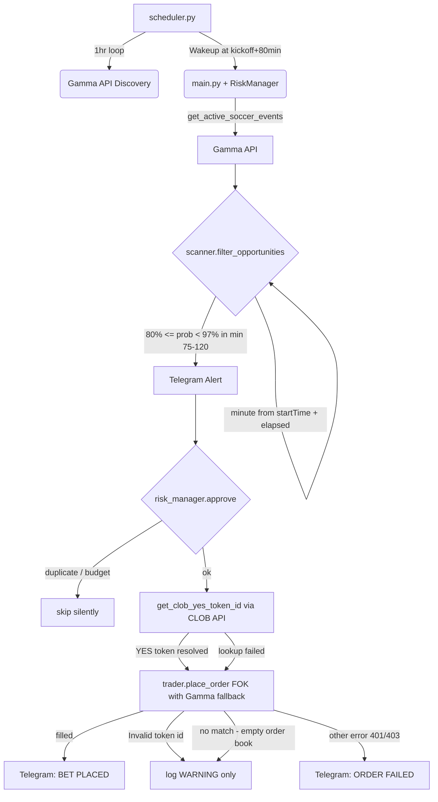

# Minutebid — Implementation Plan

## Goal
A manually-triggered Python script that scans soccer markets. It uses a **"Slow Pulse" strategy**: waking up at Minute 80, checking every 2 minutes, and surfacing outcomes where bookmaker odds hit a "Statistically Resolved" threshold (e.g., < 1.05), implying high confidence in the final result.

---

## Modules

| File | Responsibility | Status |
|------|---------------|--------|
| `config.py` | All constants, thresholds, API base URLs | ✅ Done |
| `polymarket_client.py` | Gamma API fetching, schedule discovery, price extraction | ✅ Done |
| `scanner.py` | Pure filter: time-based minute + Polymarket price >= 80% | ✅ Done |
| `display.py` | Terminal table output | ✅ Done |
| `main.py` | Entry point — orchestrates one scan | ✅ Done |
| `scheduler.py` | Long-running loop: discovery, wakeup, active scan sessions | ✅ Done |
| `requirements.txt` | Dependencies | ✅ Done |
| `.env.example` | Credential template | ✅ Done |
| `telegram_client.py` | Telegram alerts and heartbeats | ✅ Done |
| `Dockerfile` | Container definition for cloud deployment | ✅ Done |
| `.dockerignore` | Excludes secrets and artifacts from Docker image | ✅ Done |
| `risk_manager.py` | Budget cap, per-bet stake sizing, duplicate guard | ✅ Session 17 |
| `trader.py` | CLOB order placement via `py-clob-client` | ✅ Session 17 |

---

## Phases

### Phase 1 — Core Scaffold ✅
All modules wired, imports verified, dependencies installed.

### Phase 2 — Reference Price Source ✅
- Delete `betfair_client.py`
- Write `odds_api_client.py` using [The Odds API](https://the-odds-api.com)
- Update `config.py` with Odds API settings
- Update `scanner.py` for Odds API price format
- Update `.env.example` with `ODDS_API_KEY`
- Update `requirements.txt`
- Update `requirements.txt` (remove betfair-specific notes)

### Phase 5 — Smart Bot Scheduling ✅
- Added `polymarket_client.get_soccer_schedule()` for discovery.
- Created `scheduler.py` with 95-minute wakeup logic.
- Refactored `main.py` for session-based scanning.

### Phase 6 — Telegram Notifications ✅
- Send real-time alerts for discovered opportunities and bot heartbeats.
- Created `telegram_client.py` using Telegram Bot API.
- Integrated alerts into `main.py` and `scheduler.py`.
- Added credential templates to `.env.example`.

### Phase 7 — Fuzzy Team Name Matching ✅
- Improved matching reliability between Polymarket (Gamma) and Odds API.
- Implemented `rapidfuzz.token_set_ratio` to handle variations like "Arsenal FC" vs "Arsenal".
- Added automated normalization for common soccer suffixes.

### Phase 8 — Enhanced Scheduler Monitoring ✅
- Implemented `update_scheduler_dashboard` in `telegram_client.py`: sends/edits a single live message with T-minus countdowns, capped at 15 games to respect Telegram's 4096-char limit.
- Dashboard update throttled to every 300s (5 min).

### Phase 9 — Slow Pulse Monitoring (Strategic Pivot) ✅
- Reduced scan frequency to **120 seconds** (2 minutes).
- Pivoted from "Edge Hunting" to "Consensus Following" using bookmaker odds threshold.

### Phase 13 — Scanner Pivot: Polymarket-Only ✅
- Root cause: `ODDS_API_SPORT = "soccer"` is not a valid The Odds API key; free tier also has no live odds → scanner never fired a single bet alert.
- Dropped The Odds API entirely. `odds_api_client.py` deleted.
- Scanner now alerts on Polymarket price alone: any outcome >= `WIN_PROB_THRESHOLD` (80%) in the 75–90+ min window triggers a bet signal.
- Removed dead constants from `config.py` (`ODDS_API_*`, `RESOLVED_ODDS_THRESHOLD`, `MIN_EDGE_THRESHOLD`).
- `ODDS_API_KEY` credential no longer required.

### Phase 17 — Automatic Betting via CLOB ✅ LIVE
- **Trigger**: manual signal capture too slow; live signals confirmed correct; waived 2-3 week observation prerequisite.
- **New modules**: `risk_manager.py` (session-scoped budget cap + duplicate guard), `trader.py` (py-clob-client wrapper, FOK market orders).
- **Signal flow**: scanner → Telegram alert → `risk_manager.approve()` → CLOB token_id lookup → `trader.place_order()` → `risk_manager.record_bet()` → Telegram confirmation / failure alert.
- **Graceful degradation**: if CLOB credentials absent, bot continues in alert-only mode (no crash).
- **Budget**: `MAX_BET_BUDGET_USD = $5.00` per session, `BET_STAKE_USD = $1.00` flat stake.
- **Order type**: FOK (Fill or Kill) — immediate fill or cancelled; no stale orders after game ends.
- **Credentials added**: `CLOB_PK`, `CLOB_API_KEY`, `CLOB_API_SECRET`, `CLOB_API_PASSPHRASE`.
- **Deployed**: merged to main, live on Koyeb.

### Phase 17b — Hotfix: py-clob-client `side` Argument ✅
- **Error**: `MarketOrderArgs.__init__() missing 1 required positional argument: 'side'`
- **Root cause**: py-clob-client requires an explicit `side` param; `BUY` constant is not exported from `clob_types` in the installed version.
- **Fix (final)**: `_SIDE_BUY = "BUY"` string in `trader.py`. Earlier attempt used integer `0` which broke on a newer Koyeb build; string `"BUY"` is stable across all library versions.

### Phase 17c — Hotfix: Upper Probability Bound ✅
- **Error**: `PolyApiException[status_code=400, error_message={'error': 'Invalid token id'}]` on markets at 98–100¢.
- **Hypothesis**: CLOB suspends trading on near-resolved markets; Gamma still returns token IDs but CLOB rejects them.
- **Fix**: added `MAX_WIN_PROB_THRESHOLD = 0.97` — scanner now only surfaces bets in `[0.80, 0.97)`.
- **Status**: partial fix — 17c filtered the 98¢+ cases but error persisted at 80¢ → hypothesis refuted. See 17d.

### Phase 17d — Hotfix: Authoritative CLOB Token ID ✅
- **True root cause**: Gamma's `clobTokenIds` field is NOT the authoritative token for CLOB order placement. The CLOB rejects it across all probability levels (80¢, 83¢, 92¢ all failed identically). The CLOB's own `GET /markets/{condition_id}` public endpoint is the correct source.
- **Evidence**: Live failures — Werder Bremen win (80¢), O/U 1.5 (83¢), Spread -1.5 (92¢) — same error, different probabilities.
- **Fix**: `polymarket_client.get_clob_yes_token_id(condition_id)` fetches YES token from CLOB at bet time. `scanner.py` now surfaces `condition_id` in opportunity dict. `main.py` resolves authoritative token_id before placing order; Gamma's value is fallback only.
- **Key lesson**: Gamma API = discovery and price data. CLOB API = trading token IDs. Never mix sources.

### Phase 16b — Fix: display.py Silent Crash on Bet Signal ✅
- Root cause: `display.print_results()` still referenced old Odds API era fields (`reference_prob`, `resolved_outcome`, `score`). Any real opportunity caused a `KeyError`, which the scheduler's `try/except` swallowed silently — Telegram alert was never sent.
- Fix: updated `display.py` print loop to use current scanner output fields: `outcome` and `poly_prob`.
- Impact: this bug was present since the Session 15 Polymarket-only pivot. Every real signal in that window was silently discarded before reaching Telegram.

### Phase 16 — Drop WebSocket, Time-Based Minute Detection ✅
- Root cause: `wss://sports-api.polymarket.com/ws` returns 0 events every scan — the API requires a subscription message that was never sent. Scanner always skipped every game silently.
- Fix: deleted `sports_ws.py` entirely. `scanner.py` now calculates game minute as `(now - kickoff) / 60` using the event's `startTime` from the Gamma API.
- `main.py`: removed `sports_ws` import and `get_live_game_states()` call.
- `telegram_client.py`: removed score line; minute shown as `~82` to indicate estimated value.
- Net result: scanner is deterministic, no external WebSocket dependency, alerts will fire correctly in the 75–90+ min window.

### Phase 15 — Add UEFA Europa League (UEL) ✅
- Added `'europa_league': 'uel'` to `LEAGUE_TAG_SLUGS` in `config.py`.
- UEL now included in daily discovery alongside UCL, Bundesliga, EPL, La Liga, and Serie A.

### Phase 19 — Moneyline-Only Filter ✅
- **Problem**: Dashboard showed 41 monitored games including Player Props, Total Corners, Halftime Result, Exact Score, and More Markets sub-market events — only 1X2 moneyline events are wanted.
- **Root cause**: `get_soccer_schedule()` and `get_active_soccer_events()` included all Polymarket event variants. The old `_SCHEDULE_SUFFIXES` / `_base_match_title()` only deduplicated "- More Markets", "- Winner", "- Draw No Bet" but did NOT exclude "- Player Props", "- Total Corners", etc.
- **Fix**: Replaced `_base_match_title()` with `_moneyline_base_title()` in `polymarket_client.py`. Returns `None` for any title containing " - " that is not "- Winner" (moneyline naming variant). Both `add_events()` (scanner) and `find_matches()` (schedule) skip events where result is `None`.
- **Impact**: Dashboard count drops significantly (41 → ~8 per typical match day). Scanner cannot fire on player prop or corner markets.

### Phase 18b — Hotfix: Silence `"no match"` ORDER FAILED Telegram spam ✅
- **Symptom**: Every scan during a live session sent `ORDER FAILED: no match` to Telegram for "More Markets" spread/O-U sub-markets.
- **Root cause**: `py_clob_client.create_market_order()` internally calls `calculate_market_price()` → `get_order_book(token_id)`. If `book.asks is None` (zero sellers), it raises `Exception("no match")` **client-side** — no HTTP request is made. Order book is empty on thinly-traded spread markets.
- **Fix**: Added `err_str == "no match"` to silent-log guard in `main.py` alongside existing `"Invalid token id"` check. Warning logged only; no Telegram noise.
- **Diagnostic signal**: if "no match" appears WITHOUT a preceding `httpx: HTTP Request: POST` log line, it is always this client-side case.
- **Deploy note**: `fly deploy` required to push this fix live — `git push` alone does NOT trigger Fly.io rebuild.
- **Verified live (2026-02-28)**: Dortmund vs Bayern O/U 1.5 at 90¢ — BET SIGNAL fired, zero ORDER FAILED Telegram messages, warning logged only. ✅
- **Side observation**: duplicate BET SIGNAL alerts when opportunity persists across 2+ scan cycles — alerts are not session-deduplicated (only bets are). Planned fix in Session 19.

### Phase 17e — Deployment: Resolve CLOB Geoblock → Fly.io São Paulo ✅
- **Root cause**: All three Koyeb regions are blocked by Polymarket's CLOB geoblock (country-level, not datacenter-IP):
  - Frankfurt = Germany (fully blocked), Singapore (close-only, cannot open new positions), Washington DC = US (fully blocked).
- **Solution**: Fly.io `gru` (São Paulo, Brazil) — Brazil is not on Polymarket's blocked list. ~$2.20/month.
- **New file**: `fly.toml` — `shared-cpu-1x` 256MB, `auto_stop_machines = "off"`, `min_machines_running = 1`, `internal_port = 8000`.
- **Deploy workflow**: manual — `fly deploy` from project root. No auto-deploy on git push.
- **Koyeb**: retired. Cannot be used for CLOB order placement from any of its available regions.
- **Verified**: `curl -I https://minutebid-gru.fly.dev/` → `200 OK` from `gru`; scheduler heartbeating every 10 min.

### Phase 14 — Cloud Deployment (Koyeb) ✅ — RETIRED (see Phase 17e)
- Moved from local Windows machine to Koyeb free tier (always-on Linux container).
- Added `Dockerfile` using `python:3.12-slim` with `PYTHONUNBUFFERED=1` for real-time log streaming.
- Added `.dockerignore` to exclude `.env`, logs, and `__pycache__` from the image.
- Added `import platform` guard to `scheduler.py` so `SetThreadExecutionState` is a no-op on Linux.
- **Retired in Phase 17e**: all Koyeb regions blocked or restricted by Polymarket CLOB geoblock.

---

## Data Flow (current — Session 19)



---

## Key Constraints
- Credentials: never hardcoded, always in env vars
- All network calls: 10s timeout, fail gracefully with log
- Budget hard cap: `MAX_BET_BUDGET_USD` enforced before every order
- No duplicate bets: same market cannot be bet twice in one session

---


# ADDITIONAL FEATURES

## Phase 5 - Smart Daily Scheduler (Quota Aware)

### [Component] Orchestration (Scheduling)
#### [NEW] [scheduler.py](file:///c:/Python/Projects/PLYM_Bots/Minutebid/scheduler.py)
- **Discovery Mode**: On manual daily start, fetch all soccer matches starting T+24h.
- **Wakeup Logic**: Calculate `start_time + 75 minutes` and sleep until that window opens.
- **Active Scanning**: Once in the window, use WebSocket to track live minute. Trigger scan only during `75-90+`.

#### [MODIFY] [main.py](file:///c:/Python/Projects/PLYM_Bots/Minutebid/main.py)
- Refactor scanning logic to be callable as `run_scan(event_ids)` for specific targeted events.

### [Component] Configuration
#### [MODIFY] [config.py](file:///c:/Python/Projects/PLYM_Bots/Minutebid/config.py)
- Add discovery thresholds and scheduling constants.

## Phase 8 - Scheduler UI (Telegram) ✅

### [Component] Telegram Client
#### [DONE] [telegram_client.py](file:///c:/Python/Projects/PLYM_Bots/Minutebid/telegram_client.py)
- `update_scheduler_dashboard(runs)`: sends or edits a single live Telegram message with T-minus countdowns. Capped at 15 games. Persists message ID to `.dashboard_msg_id` for in-place edits.

### [Component] Orchestration
#### [DONE] [scheduler.py](file:///c:/Python/Projects/PLYM_Bots/Minutebid/scheduler.py)
- Dashboard update throttled to 300s interval via `last_dashboard_update` tracker.
- Discovery (1h), dashboard (5m), and scan (15s) cycles are fully independent.

## Verification Plan

### Manual Verification
- Run discovery and confirm the list of "Today's Games" is accurate.
- Verify the bot sleeps/wakes correctly during a simulated match window.
- Monitor Odds API call logs to ensure zero waste.

---

## Future Development — Phase 16: Automatic Betting

### Overview
Once the bot proves profitable through manual observation, Minutebid can be extended to place bets automatically using a fixed budget (e.g. $10 USD) with no manual intervention per signal.

### How It Works
Polymarket exposes a CLOB (Central Limit Order Book) API that supports programmatic order placement. The official `py-clob-client` Python SDK handles cryptographic signing and order building.

### New Components Required

| File | Role |
|------|------|
| `trader.py` | New module: `place_order(token_id, stake_usdc)` via `py-clob-client` |
| `risk_manager.py` | New module: budget cap, per-bet stake, duplicate-market guard |
| `config.py` | Add `MAX_BET_BUDGET_USD`, `BET_STAKE_USD`, `CLOB_API_KEY`, `CLOB_API_SECRET` |
| `main.py` | Wire opportunity → risk_manager → trader |
| `telegram_client.py` | Add `send_order_confirmation()` alert |
| `.env.example` | Add `CLOB_API_KEY`, `CLOB_API_SECRET` |

### Signal Flow (new)
```
scanner finds opportunity
  → risk_manager approves stake size
  → trader.place_order(token_id, stake_usdc)
  → Telegram: "✅ BET PLACED: $1.00 on Arsenal @ 87¢"
```

### Prerequisites Before Building
1. ~~2–3 weeks of live signal monitoring~~ — **waived**: multiple live signals confirmed correct; manual execution too slow to capture opportunities in time
2. ~~Polymarket account~~ — **ready** ✅
3. Fund Polymarket account with USDC on Polygon
4. Generate CLOB API credentials in Polymarket UI
5. Decide on staking strategy (flat stake recommended first)

### Key Risks
- **Key exposure**: private key in Koyeb env vars (same pattern as TELEGRAM_TOKEN — acceptable)
- **Runaway bets**: scanner bug fires many signals → `MAX_BET_BUDGET_USD` hard cap prevents overspend
- **Slippage**: market orders near 87¢ may fill worse; check `bestAsk` before committing
- **CLOB downtime**: order silently fails → must alert on failure via Telegram
