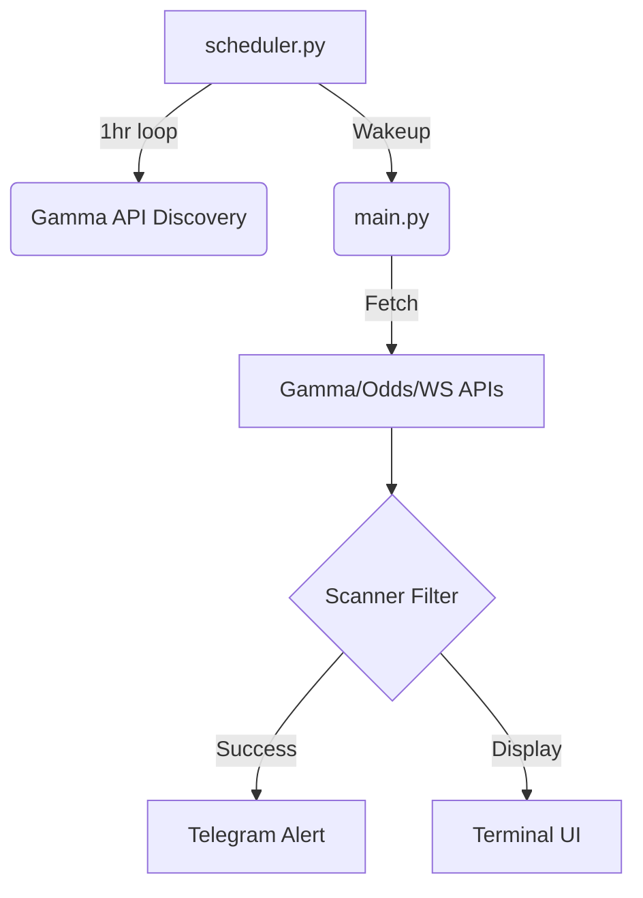

# Minutebid — Implementation Plan

## Goal
A manually-triggered Python script that scans Polymarket for live soccer markets in minutes 75–90+, surfaces outcomes with >80% implied win probability, and cross-references The Odds API to detect mispriced opportunities (edge).

---

## Modules

| File | Responsibility | Status |
|------|---------------|--------|
| `config.py` | All constants, thresholds, API base URLs | ✅ Done — needs Odds API constants |
| `polymarket_client.py` | Gamma API + CLOB API HTTP calls | ✅ Done |
| `sports_ws.py` | Polymarket Sports WebSocket → live game minute/score | ✅ Done |
| `odds_api_client.py` | The Odds API → reference prices from major bookmakers | ✅ Done |
| `scanner.py` | Pure filter: 75-90 min + >80% prob + edge calc | ✅ Done |
| `display.py` | Terminal table output | ✅ Done |
| `main.py` | Entry point — orchestrates one scan | ✅ Done |
| `requirements.txt` | Dependencies | ✅ Done |
| `.env.example` | Credential template | ✅ Done |
| `telegram_client.py` | Telegram alerts and heartbeats | ✅ Done |

---

## Phases

### Phase 1 — Core Scaffold ✅
All modules wired, imports verified, dependencies installed.

### Phase 2 — Reference Price Source ✅
- Delete `betfair_client.py`
- Write `odds_api_client.py` using [The Odds API](https://the-odds-api.com)
- Update `config.py` with Odds API settings
- Update `scanner.py` for Odds API price format
- Update `.env.example` with `ODDS_API_KEY`
- Update `requirements.txt`
- Update `requirements.txt` (remove betfair-specific notes)

### Phase 5 — Smart Bot Scheduling ✅
- Added `polymarket_client.get_soccer_schedule()` for discovery.
- Created `scheduler.py` with 95-minute wakeup logic.
- Refactored `main.py` for session-based scanning.

### Phase 6 — Telegram Notifications ✅
- Send real-time alerts for discovered opportunities and bot heartbeats.
- Created `telegram_client.py` using Telegram Bot API.
- Integrated alerts into `main.py` and `scheduler.py`.
- Added credential templates to `.env.example`.

### Phase 7 — Fuzzy Team Name Matching ✅
- Improved matching reliability between Polymarket (Gamma) and Odds API.
- Implemented `rapidfuzz.token_set_ratio` to handle variations like "Arsenal FC" vs "Arsenal".
- Added automated normalization for common soccer suffixes.

### Phase 8 — Enhanced Scheduler Monitoring
- Implement `send_schedule_summary` to notify user via Telegram of all monitored games for the next 24h.
- Include countdowns (T-minus) for each match kickoff/wakeup window.
- Update `scheduler.py` to trigger this report after each discovery cycle.

---

## Data Flow

---

## Key Constraints
- Read-only — no order placement
- No polling loop — one scan per manual run
- Credentials: `ODDS_API_KEY` in `.env`, never in code
- All network calls: 10s timeout, fail gracefully with log

---

# ADDITIONAL FEATURES

## Phase 5 - Smart Daily Scheduler (Quota Aware)

### [Component] Orchestration (Scheduling)
#### [NEW] [scheduler.py](file:///c:/Python/Projects/PLYM_Bots/Minutebid/scheduler.py)
- **Discovery Mode**: On manual daily start, fetch all soccer matches starting T+24h.
- **Wakeup Logic**: Calculate `start_time + 75 minutes` and sleep until that window opens.
- **Active Scanning**: Once in the window, use WebSocket to track live minute. Trigger scan only during `75-90+`.

#### [MODIFY] [main.py](file:///c:/Python/Projects/PLYM_Bots/Minutebid/main.py)
- Refactor scanning logic to be callable as `run_scan(event_ids)` for specific targeted events.

### [Component] Configuration
#### [MODIFY] [config.py](file:///c:/Python/Projects/PLYM_Bots/Minutebid/config.py)
- Add discovery thresholds and scheduling constants.

## Phase 8 - Scheduler UI (Telegram)

### [Component] Telegram Client
#### [MODIFY] [telegram_client.py](file:///c:/Python/Projects/PLYM_Bots/Minutebid/telegram_client.py)
- Add `send_schedule_summary(runs)` to format and send a list of monitored games.

### [Component] Orchestration
#### [MODIFY] [scheduler.py](file:///c:/Python/Projects/PLYM_Bots/Minutebid/scheduler.py)
- Call `send_schedule_summary` after `get_upcoming_runs()`.
- Ensure redundant updates are minimized (only send when schedule changes).

## Verification Plan

### Manual Verification
- Run discovery and confirm the list of "Today's Games" is accurate.
- Verify the bot sleeps/wakes correctly during a simulated match window.
- Monitor Odds API call logs to ensure zero waste.
